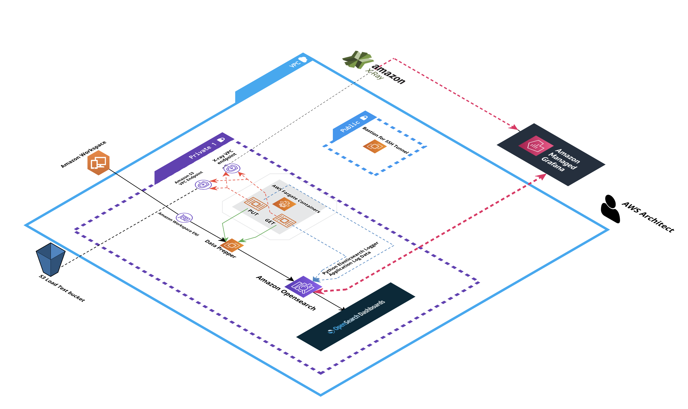

# Trace Analytics

Purpose: Create and Put more files into a single S3 bucket as the PUT application scales out.  Get the files from the S3 bucket as the GET application scales out. Monitor execution using X-Ray, Open Telemetry, Grafana, and log the data using the python-elasticsearch-logger.  https://github.com/drumadrian/python-elasticsearch-logger




## Summary

The goal of this project is to compare using AWS Managed Graphana for observability VS OpenSearch Dashboards.  
The S3 load test creates as many files as possible and puts the files into an S3 bucket.
The code running in the Fargate containers in instrumented and includes logging via the Python Elasticsearch logger. 


Steps: 

These steps are guidance and can be executed out of order by an experienced operator:

* Create Amazon ECR Respositories (PUT container, GET container, X-Ray container)
* Provision a VPC with 2 private subnets and 1 public subnet 
* Provision a new Opensearch domain into the private subnets of the VPC
* Create an Amazon Managed Grafana instance
* Deploy the Cloudformation template for the Data Prepper
  * https://aws.amazon.com/blogs/big-data/getting-started-with-trace-analytics-in-amazon-elasticsearch-service/
* Build and Push the containers to the matching ECR repo
* Put the bucket name of the newly created bucket into the container code
* Deploy 
* Deploy the Fargate application and monitor X-Ray, CloudWatch metrics, and CloudWatch logs

</br>


### All environment variables for each Docker container's creation: 

```
cd trace-analytics
export AWS_REGION=us-west-2

export GET_REPOSITORY_NAME=<get-repository-name>
export GET_REPOSITORY_URI=<get-repository-uri>

export PUT_REPOSITORY_NAME=<put-repository-name>
export PUT_REPOSITORY_URI=<put-repository-uri>

export XRAY_REPOSITORY_NAME=<xray-repository-name>
export XRAY_REPOSITORY_URI=<xray-repository-uri>


Optional: 
echo $AWS_REGION
echo $GET_REPOSITORY_NAME
echo $GET_REPOSITORY_URI
echo $PUT_REPOSITORY_NAME
echo $PUT_REPOSITORY_URI
echo $XRAY_REPOSITORY_NAME
echo $XRAY_REPOSITORY_URI

```


### Commands to Build GET container zip file: 
###### (to be uploaed to ECR for Fargate):
```
cd getcontainer
aws ecr get-login-password --region $AWS_REGION | docker login --username AWS --password-stdin $GET_REPOSITORY_URI
docker build \
-t $GET_REPOSITORY_NAME:latest .
docker tag $GET_REPOSITORY_NAME:latest $GET_REPOSITORY_URI:latest
docker push $GET_REPOSITORY_URI:latest
cd ..
```


### Commands to Build PUT container zip file: 
###### (to be uploaed to ECR for Fargate):
```
cd putcontainer
aws ecr get-login-password --region $AWS_REGION | docker login --username AWS --password-stdin $PUT_REPOSITORY_URI
docker build 
-t $PUT_REPOSITORY_NAME:latest .
docker tag $PUT_REPOSITORY_NAME:latest $PUT_REPOSITORY_URI:latest
docker push $PUT_REPOSITORY_URI:latest
cd ..

```


### Commands to Build X-Ray container zip file: 
###### (to be uploaed to ECR for Fargate):
```
cd xraycontainer
aws ecr get-login-password --region $AWS_REGION | docker login --username AWS --password-stdin $XRAY_REPOSITORY_URI
docker build \
-t $GET_REPOSITORY_NAME:latest .
docker tag $XRAY_REPOSITORY_NAME:latest $XRAY_REPOSITORY_URI:latest
docker push $XRAY_REPOSITORY_URI:latest
cd ..


```


### References:

https://www.jaegertracing.io/docs/1.21/architecture/#agent

https://aws.amazon.com/blogs/big-data/getting-started-with-trace-analytics-in-amazon-elasticsearch-service/

https://www.youtube.com/watch?v=nfdugGbvyuQ&list=WL&index=2&t=614s

https://docs.aws.amazon.com/vpc/latest/privatelink/vpc-endpoints.html


https://stackoverflow.com/questions/10607688/how-to-create-a-file-name-with-the-current-date-time-in-python

https://stackoverflow.com/questions/14275975/creating-random-binary-files

http://ls.pwd.io/2013/06/parallel-s3-uploads-using-boto-and-threads-in-python/

https://docs.aws.amazon.com/AmazonS3/latest/user-guide/empty-bucket.html

https://docs.aws.amazon.com/AmazonS3/latest/user-guide/configure-metrics.html


https://stackoverflow.com/questions/71182063/cannot-import-name-requestshttpconnection-from-elasticsearch


https://boto3.amazonaws.com/v1/documentation/api/latest/guide/session.html

https://docs.aws.amazon.com/xray/latest/devguide/xray-python-opentel-sdk.html

https://aws-otel.github.io/docs/getting-started/python-sdk/trace-auto-instr

https://docs.aws.amazon.com/xray-sdk-for-python/latest/reference/basic.html


# Install required packages for instrumentation and to support tracing with AWS X-Ray
$ pip install opentelemetry-distro[otlp]>=0.24b0 \
              opentelemetry-sdk-extension-aws~=2.0 \
              opentelemetry-propagator-aws-xray~=1.0

